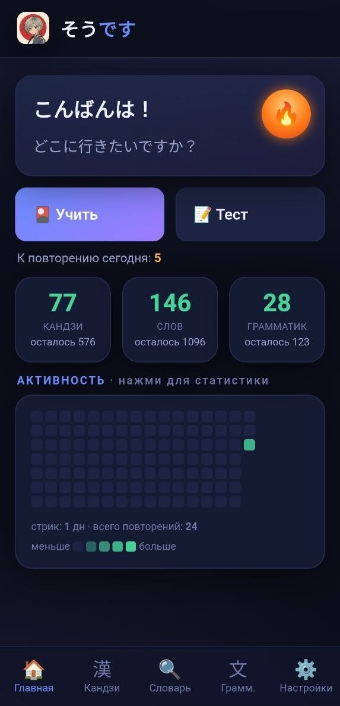

# そうです · Sodesu

**Японский в одном месте: кандзи, слова, грамматика, словарь, тесты и JLPT.**

Офлайн-приложение для изучения японского по учебникам **Genki I & II** — интервальное повторение (как Anki), офлайн-словарь, карточки грамматики, тесты и пробники JLPT.

`версия 0.9 (beta)` · `Android (APK)` · `iOS (Xcode/WKWebView)` · `офлайн` · `бесплатно, без рекламы`

### [⬇️ Скачать последний релиз (APK)](https://github.com/Severoff03/sodesu/releases/latest)

---

## ✨ Возможности

- 🎴 **Учить** — карточки с интервальным повторением (SM-2): кандзи, слова, грамматика. Свайпы: вправо «знаю», влево «трудно» + перевод.
- 📚 **Библиотеки материалов** — Genki 1, Genki 2, «Полезные материалы», «Моя библиотека». Включаются по отдельности, у каждой — свой диапазон уроков. Структура расширяемая (задел под N3/N2 и др.).
- 🔍 **Офлайн-словарь** — поиск по кандзи, кане, английскому и русскому; русский крупнее, английский как дополнение; избранное; свайп-отметка «знаю».
- 文 **Грамматика** — конструкции из Genki с короткими подсказками и развёрнутыми объяснениями (по тапу).
- 📝 **Тесты** — варианты: слова, кандзи, грамматика, JLPT (+ Текст и Аудирование — в разработке). Выбор статуса (новое/учу/знаю/недавно изученные), несколько уроков и библиотек сразу, режимы (выбор RU/JP/ввод), фуригана, лимит времени, история с разбором ответов.
- 🎌 **JLPT пробник** — N5, N4, N3, отдельный банк вопросов.
- 🎨 **Темы** — Светлая, Тёмная, Дзен, Ретро, 空, Yuru Camp; свои фоны на любую тему; тихие звуковые эффекты с регулировкой громкости.
- 📈 **Прогресс** — карта активности (как на GitHub), статистика за 7 дней, дневные лимиты новых карточек.
- 🔄 **Перенос прогресса** — экспорт/импорт файла и перенос кодом между устройствами; импорт/экспорт своих библиотек.

---

## 📱 Скриншоты

| Главная | Кандзи | Словарь |
|---|---|---|
|  |  |  |

| Тест | Викторина |
|---|---|
|  |  |

---

## ⬇️ Установка

### Android

1. Скачай APK из раздела [**Releases**](https://github.com/Severoff03/sodesu/releases/latest).
2. На телефоне разреши установку из неизвестных источников.
3. Установи и открой. Интернет не нужен.

### iPhone

iOS-версия находится в папке `ios/` и использует тот же офлайн-каталог `www/` через нативный `WKWebView`.

1. Открой `ios/Sodesu.xcodeproj` в Xcode.
2. Выбери схему `Sodesu` и Simulator или подключённый iPhone.
3. Для физического iPhone укажи свой Apple Developer Team в Signing & Capabilities.
4. Нажми Run. Прогресс хранится в `localStorage`, импорт/экспорт остаётся через JSON.

При первом запуске iOS попросит разрешение на локальные уведомления. Ежедневное напоминание планируется около 10:00, а “Рупа-чан скучает” появляется после 2+ дней без открытия приложения.

---

## 🗺 Road Map

- [ ] おみくじ — полезные предсказания
- [ ] Библиотека по «Минна но нихонго»
- [ ] Тексты с вопросами
- [ ] Аудирование
- [ ] Библиотеки для N3
- [ ] Библиотеки для N2
- [ ] Расширенный словарь Jisho

Текущий статус: бета. Библиотеки и инструментарий пока покрывают уровни **N5–N4**; более высокие уровни будут добавляться по мере изучения языка автором.

---

## 💚 Поддержать

Приложение полностью бесплатное и без рекламы. Если хочется поддержать развитие — донат на Boosty (ссылка в профиле).

---

## 🧱 Технологии

Чистый HTML/CSS/JS (без фреймворков), обёрнутый в Android WebView и iOS WKWebView. Код разбит на модули (`www/js/*.js`). Данные — в `www/js/data.js` (библиотеки кандзи/слов/грамматики).

> В разработке проекта используется нейросеть **Claude** (Anthropic) — как помощник в написании и рефакторинге кода.

---

## 📄 Лицензия

Код — [MIT](LICENSE). По учебному контенту см. [NOTICE.md](NOTICE.md).
Разработчик: **Mothman**.
